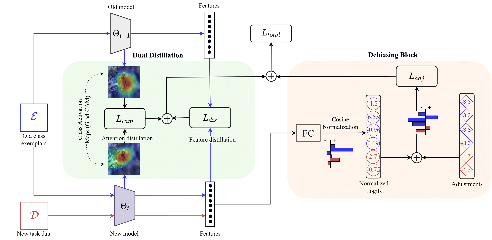

## Adapting a hybrid ViT for Class Incremental Continual Learning



## Highlights

- A hybrid ViT (NesT) is adapted for continual learning
- Inherent bias during exemplar based continual learning is reduced by using a logit adjustment strategy
- Spatial awareness of the model is improved using attention based distillation and coupled with feature level distillation
- Considerable improvements in accuracy observed for small and large datasets


## Getting Started

Min requirements: python 3.8, CUDA 11.3 and pytorch version 1.10.1

Download Anaconda and read the installation instructions on the official website:
<https://www.anaconda.com/download/>

Create a new environment from the provided yml file:

```bash
conda env create -f incremental.yml
conda activate D3former
```


## Datasets

<strong>CIFAR100</strong> will be downloaded automatically by torchvision when running the experiments.

<strong>ImageNet-subset100</strong> can be downloaded by following the instructions [here](https://github.com/yaoyao-liu/class-incremental-learning/tree/main/adaptive-aggregation-networks#imagenet-subset)

<strong>ImageNet1K</strong> can be downloaded from the [official website](https://www.image-net.org/download.php)

The corresponding path of the folder has to be set as `data_dir` argument in [main.py](main.py)

## Running Experiments

<strong> For CIFAR-100</strong>

```bash
python3 main.py --gpu 0 --dataset cifar100 --nb_cl_fg 50 --nb_cl 10 --the_lambda 10 --tau 1 --gamma 0.1 --warmup 10
```
```bash
python3 main.py --gpu 0 --dataset cifar100 --nb_cl_fg 50 --nb_cl 5 --the_lambda 10 --tau 1 --gamma 0.1 --warmup 10
```
```bash
python3 main.py --gpu 0 --dataset cifar100 --nb_cl_fg 50 --nb_cl 2 --the_lambda 10 --tau 1 --gamma 0.1 --warmup 10
```


<strong>ImageNet subset-100</strong>

```bash
python3 main.py --gpu 0 --dataset imagenet_sub --nb_cl_fg 50 --nb_cl 10 --the_lambda 4 --tau 0.3 --gamma 0.05 --warmup 20
```
```bash
python3 main.py --gpu 0 --dataset imagenet_sub --nb_cl_fg 50 --nb_cl 5 --the_lambda 4 --tau 0.3 --gamma 0.05 --warmup 20
```
```bash
python3 main.py --gpu 0 --dataset imagenet_sub --nb_cl_fg 50 --nb_cl 2 --the_lambda 4 --tau 0.3 --gamma 0.05 --warmup 20
```


<strong>ImageNet-1K</strong>

```bash
python3 main.py --gpu 0 --dataset imagenet --nb_cl_fg 500 --nb_cl 100 --the_lambda 4 --tau 0.3 --gamma 0.05 --warmup 20
```
```bash
python3 main.py --gpu 0 --dataset imagenet --nb_cl_fg 500 --nb_cl 50 --the_lambda 4 --tau 0.3 --gamma 0.05 --warmup 20
```

## Acknowledgement

This code is built upon [AANet](https://github.com/yaoyao-liu/class-incremental-learning/tree/main/adaptive-aggregation-networks). Many thanks to the authors for their implementation.
