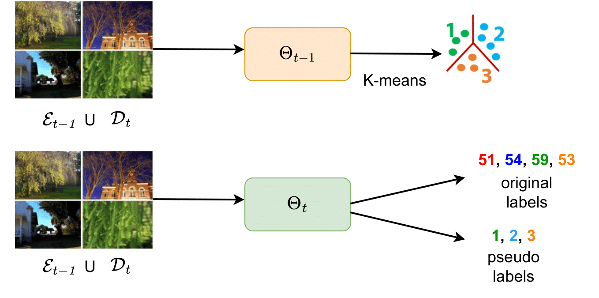

# Exploiting acquired knowledge for Class Incremental Continual Learning



## Highlights

- Continual learning methods usually create a new model and initialize it with the weights of the old model whenever a new task is introduced
- This initialization is not robust to data distribution shifts
- Using a unsupervised pretraining, an attempt is made to augment a better initialization before learning new classes using the acquired knowledge


## Getting Started

Create a new environment and install PyTorch and torchvision on it:

```
conda create --name pretrain python=3.6
conda activate pretrain
conda install pytorch=1.2.0 
conda install torchvision -c pytorch
```

Install other requirements:

```
pip install tqdm scipy sklearn tensorboardX Pillow==6.2.2
```

## Datasets

<strong>CIFAR100</strong> will be downloaded automatically by torchvision when running the experiments.
The corresponding path of the folder has to be set as `data_dir` argument in [main.py](main.py)

## Running Experiments

<strong> For CIFAR-100</strong>

```bash
cd adaptive-aggregation-networks
python main.py --nb_cl_fg=50 --nb_cl=10 --gpu=0 --random_seed=1993 --baseline=lucir --branch_mode=single --branch_1=free --dataset=cifar100
```

## Acknowledgement

This code is built upon [AANet](https://github.com/yaoyao-liu/class-incremental-learning/tree/main/adaptive-aggregation-networks). Many thanks to the authors for their implementation.
